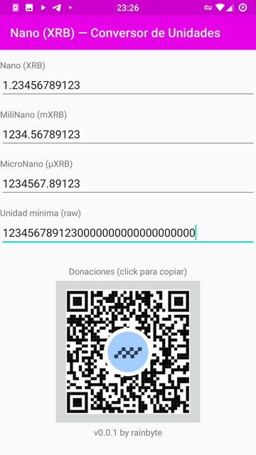
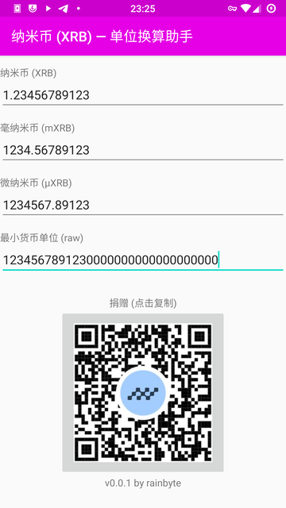
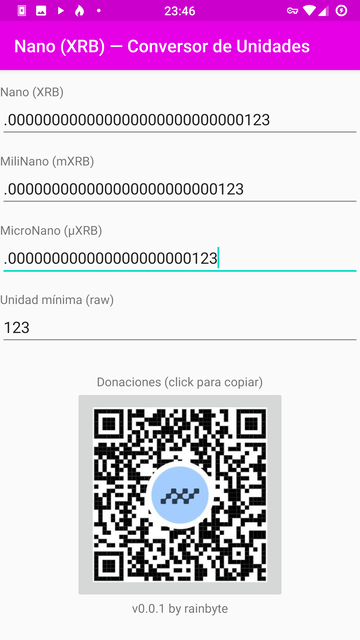

# Nano (XRB) — Unit Converter

This is an Android app which lets people convert values between the most common
monetary units of Nano (XRB) cryptocurrency.

Just write a value and it will be converted to other units automatically.

The Unit Converter is designed to be as simple and light as possible.

Features showcase:

- Spanish language UI

  

- Chinese language UI

  

- Small amount can be expressed in Raw unit

  
